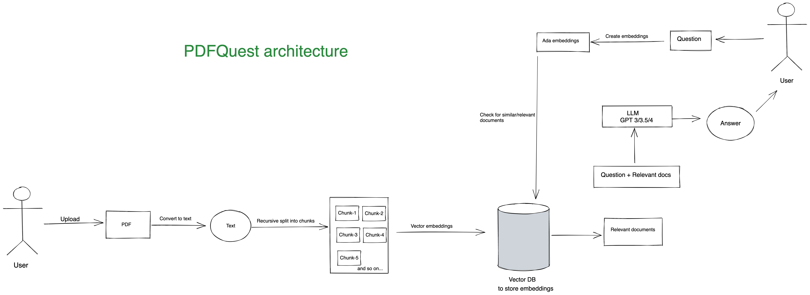

# 🪄 PDFQuest: PDF Question-Answer tool

PDFQuest is an AI-powered PDF QA tool that enables you to easily upload and analyze PDF documents with **advanced question-answering capabilities**. PDFQuest goes beyond traditional keyword-based search and utilizes *vector embeddings* and *semantic search* to deliver precise and efficient results from your PDFs to improve your workflow efficiency.

## Installation

1. Clone the repository using `git clone https://github.com/ayush-vibrant/PDFQuest.git`
2. Navigate to the project directory by running `cd PDFQuest`
3. Install the required packages using `pip install -r requirements.txt`

## Usage

To use PDFQuest, simply run `python -m streamlit run folder-location/PDFQuest/streamlit/main.py` in your terminal. This will start a local server that you can access through your web browser.
In the command, replace folder-location/ with the actual path to the PDFQuest directory on your machine.


## Environment Variables

Before running the app, make sure to create a `.env` file in your local system and add the following environment variables:

```
OPENAI_API_KEY=<your openai api key>
PINECONE_API_KEY=<your pinecone api key>
PINECONE_API_ENV=<your pinecone api env>
USE_PINECONE=false
PINECONE_INDEX_NAME=<test>
TEMPERATURE=0
QA_WITH_SOURCE=false
```


For streamlit applications. Secrets management happens from a different file. See [this](https://docs.streamlit.io/streamlit-community-cloud/get-started/deploy-an-app/connect-to-data-sources/secrets-management) for more information.

Add a file called `secrets.toml` in a folder called `.streamlit` at the root of your app repo, and copy/paste your secrets into that file.
```
OPENAI_API_KEY="your openai api key"
PINECONE_API_KEY="your pinecone api key"
PINECONE_API_ENV="your pinecone api env"
USE_PINECONE="false"
PINECONE_INDEX_NAME="test"
TEMPERATURE="0"
QA_WITH_SOURCE="false"
```

## Architecture



